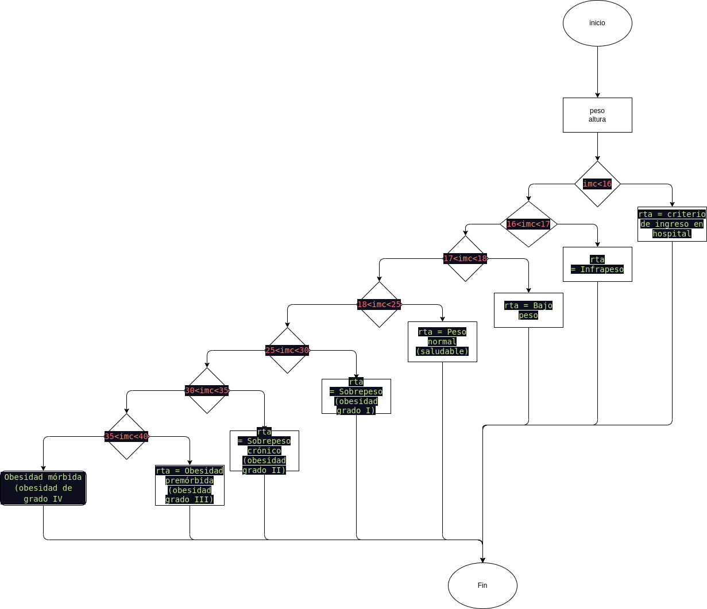

# EJERCICIO 4

# PROBLEMA
Construir un programa que calcule el índice de masa corporal de una
persona (IMC = peso[kg] / altura² [m]) e indique el estado en el que se
encuentra esa persona en función del valor del IMC:
IMC  DIAGNOSTICO

<16 Criterio de ingreso en hospital
De 16 a 17 Infrapeso
De 17 a 18 Bajo peso
De 18 a 25 Peso normal (saludable)
De 25 a 30 Sobrepeso (obesidad grado I)
De 30 a 35 Sobrepeso crónico (obesidad grado II)
De 35 a 40 Obesidad premórbida (obesidad grado III)
>4O Obesidad mórbida (obesidad de grado IV)

# ANALISIS
